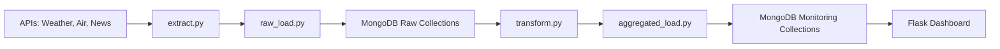

# 🌎 Environmental Data Dashboard

This project provides a complete ETL pipeline and interactive dashboard to monitor environmental conditions across various cities in Mexico. It extracts data from public APIs for weather, air quality, and news, stores the results in a database, and displays insights using a lightweight web interface.

## 🚀 Features

- **ETL pipeline with Airflow**
  - Extracts weather, air quality, and environment-related news
  - Cleans and transforms data from multiple APIs
  - Stores both raw and processed data
- **Web dashboard using Flask**
  - Displays aggregated weather and air quality metrics
  - Presents top environmental news for each city
- **Dockerized environment**
  - Easy setup using `docker-compose`

## 🗂️ Project Structure

```
.
├── Dockerfile                  # Base Dockerfile (optional use)
├── docker-compose.yml         # Container orchestration
├── requirements.txt           # Python dependencies
├── README.md                  # This file

├── app/
│   ├── Dockerfile             # Dockerfile for the Flask app
│   ├── app.py                 # Flask dashboard logic
│   └── requirements.txt       # Flask app dependencies

├── dags/
│   ├── aggregated\_load.py     # Loads processed data into MongoDB
│   ├── dag\_orchestrator.py    # Main Airflow DAG definition
│   ├── extract.py             # Extracts from all APIs
│   ├── raw\_load.py            # Loads raw data into MongoDB
│   └── transform.py           # Cleans and transforms raw data
```

> 🧹 `__pycache__` and `logs/` folders are excluded for clarity.

## ⚙️ Tech Stack

| Layer        | Tools Used                            |
|--------------|----------------------------------------|
| Orchestration| Apache Airflow                         |
| Backend      | Python, Flask                          |
| Dashboard UI | HTML (via Flask templates), CSS        |
| Storage      | MongoDB (for raw and transformed data) |
| APIs         | Open-Meteo, Air Quality, NewsAPI       |
| Deployment   | Docker, Docker Compose                 |

## 📦 Setup Instructions

### 1. Clone the repository
```bash
git clone <your-repo-url>
cd <project-directory>
````

### 2. Launch with Docker Compose

```bash
docker-compose up --build
```

### 3. Access the services

* **Airflow Web UI**: [http://localhost:8080](http://localhost:8080)
* **Flask Dashboard**: [http://localhost:5000](http://localhost:8501)

### 4. Trigger the DAG

Use Airflow's UI to manually trigger the DAG `ENVIRONMENTAL_DATA_POLLUTION_MONITOR` or let it run on schedule.

---

## 📊 Data Flow Summary



## 🧪 Testing

You can test specific DAG tasks in isolation using Airflow's UI or CLI with:

```bash
airflow tasks test <dag_id> <task_id> <execution_date>
```

## 📌 Notes

* Don't forget to configure your API keys in the appropriate environment variables or config file.
* The system handles multiple cities and is scalable for more.
* Logs are stored under `logs/` but are not versioned.

---

## 📜 License

This project is for educational purposes only. For reuse or collaboration, please contact the author.


